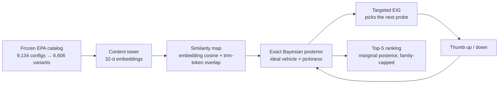

<div align="center">

# Targeted Bayesian Active Preference Learning

**A recommender that learns your broad taste from nothing but thumbs — each vehicle it shows you is chosen to reveal as much as possible about what you want.**

Python 3.12 · PyTorch · FastAPI · PostgreSQL + pgvector · frozen EPA catalog, 6,606 vehicles, model years 2017–2026

</div>

---

## Quick start

```bash
docker compose up -d db
python3 -m venv .venv
.venv/bin/pip install -r requirements-dev.txt
.venv/bin/hatch run serve
open http://127.0.0.1:8000
```

The browser session shows one vehicle at a time with thumbs-up/down controls and a live top-three list. Other useful commands: `.venv/bin/hatch run test` (full suite), `test-nodb` (skips the Postgres suites), `verify` (compile + diff check + tests), and `benchmark` (the focused Precision@5 benchmark).

## Implementation map

| File | What it does |
|---|---|
| `app/model.py` | Neural content tower: EPA attributes → frozen 32-d vehicle embeddings |
| `app/preference.py` | Bayesian ideal-point posterior, Targeted EIG probe selection, ranking |
| `app/main.py` | FastAPI service: probe, feedback, recommendations, reset, health |
| `app/vehicle-session.html` | The entire browser UI, one self-contained file |
| `app/benchmark.py` | Deterministic Precision@5 benchmark against the exact live stack |

## The question

Most recommenders either make you fill out filters or need a long behavioral history. This project starts with neither: a shopper reacts to complete vehicle packages with a thumbs-up or thumbs-down, and nothing else. No attribute chips, no surveys, no "what did you dislike about it?"

That signal is genuinely ambiguous. A thumbs-down on a loaded Tundra doesn't mean the shopper hates trucks, or 4WD, or Toyota — it means *this complete package is not my choice*. The interesting problem is extracting a preference from a stream of such low-bandwidth, package-level judgments without over-interpreting any single one.

The goal is deliberately not to guess one exact hidden vehicle. It is to learn the **region** of the catalog the shopper prefers — trucks, electric cars, premium brands — and make the recommendation list consistently live there. Success is defined as Precision@5 ≥ 0.80: at least four of the top five recommendations fit the shopper's broad preference, where every thumb counts as one swipe.

## How it works



**1. Learn the catalog.** A small neural tower embeds each vehicle from real EPA attributes — make, vehicle class, fuel type, drivetrain, transmission, efficiency, cylinders, displacement, electric range, tailpipe CO2, model year — into 32 dimensions, pretrained on deterministic synthetic interactions with held-out rules excluded. Similarity blends embedding cosine with token overlap of the EPA model string (the only honest handle on trim identity like "Tundra 4WD PRO"). No MSRP, horsepower, or marketing data is fabricated.

**2. Represent uncertainty about the shopper.** The shopper is modeled as having one unknown ideal vehicle *t* and one unknown pickiness threshold *θ*. A thumb on shown vehicle *x* is a Bernoulli observation:

```text
P(up | x, t, θ) = sigmoid(10 · (sim(x, t) − θ))
```

where `sim(x, t)` is the blended similarity in [0, 1] and 10 is a fixed sharpness constant. The joint posterior over every vehicle × a discrete θ grid is computed exactly, in memory, from the complete feedback history — no sampling, no approximation. Because a rejection can be explained by either dissimilarity or high pickiness, one thumbs-down narrows the search without branding every attribute on that vehicle as disliked.

**3. Ask the most useful question.** The probe policy is Targeted Expected Information Gain — technically, targeted mutual-information active learning for a Bayesian ideal-point recommender. Each probe maximizes

```text
I(next thumb ; ideal vehicle)
```

with the threshold integrated out as a nuisance variable, blended toward exploitation as posterior entropy falls. Candidates come from a hierarchical pool (one representative per nameplate plus the current posterior leaders), so probing sweeps the catalog coarse-to-fine instead of drilling near-identical siblings.

**4. Rank and repeat.** After each thumb the posterior is recomputed from scratch and unrated vehicles are ranked by their marginal probability of being the ideal. A per-family cap keeps one model-year family from flooding the visible list, while adjacent model years of the same vehicle remain valid when they offer meaningful alternatives. PostgreSQL holds the catalog, embeddings, and feedback; feedback is the sole mutable state, so the identical posterior is reconstructed after a restart.

## Why the threshold is a nuisance variable

Joint EIG — maximizing information about (ideal, threshold) together — can value a probe for learning how *picky* the shopper is even when it does not distinguish vehicles. Targeted EIG only counts bits that reduce uncertainty about the ideal vehicle itself, so probe value stays tied to *what the shopper wants* rather than how they grade. The threshold still does its job in the background: marginalizing it is what lets the model absorb a rejection near an endorsed vehicle as "close, but not quite good enough" instead of collapsing the whole neighborhood.

## What we learned along the way

Earlier iterations tried greedy ranking, passive Bayesian updates, joint EIG, diversity heuristics, approval-first probing, and a type-level content model. They were mostly useful for discovering what the objective should be: exact-vehicle retrieval rewards different behavior than broad preference matching. Greedy was fast on easy shoppers but had a long tail (15 swipes for the electric case, 10 for the sporty one); the type-first model never discovered the electric preference at all. Targeted EIG had the best balanced worst case, so it is the one methodology this repository keeps.

## Benchmark

The focused benchmark runs the exact live stack against five broad preference proxies defined over frozen EPA attributes, each starting from a cold posterior and thumbed deterministically by its predicate:

| Case | Proxy definition |
|---|---|
| Passenger car | EPA car classes, excluding wagons and two-seaters |
| Pickup truck | EPA pickup-truck classes |
| Premium brand | make ∈ {BMW, Lexus, Mercedes-Benz, Cadillac, Audi, Acura} |
| Electric passenger car | car proxy + electric range > 0 + no cylinders |
| Performance SUV | SUV class + (≥6 cylinders or a performance trim token) |

All five cases reached stable ≥80% Precision@5 within six swipes and finished at 100%. Median first-80% was 2 swipes, median stable-80% was 3, and the worst stable case took 6. Run it yourself with `.venv/bin/hatch run benchmark`; artifacts (events, summary, chart) are content-addressed under `artifacts/benchmarks/`.

**What this evidence is and isn't.** These are synthetic regression proxies, not human validation. EPA data has no exterior color, price, horsepower, or reliable sedan body-style label, so the premium and performance cases are explicit proxies built from what the data honestly supports — each predicate and its caveat is recorded in the benchmark output. Catalog provenance, checksums, and counts live in `data/catalog_manifest.json`.
