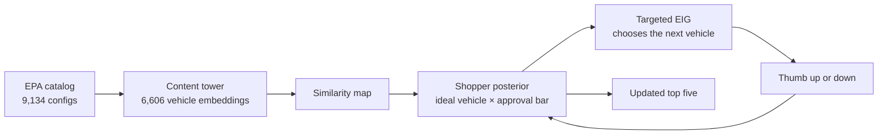

<div align="center">

# Targeted Bayesian Active Preference Learning

**How much can a recommender learn from a few thumbs? This one treats every vehicle it shows as a question.**

Python 3.12 · PyTorch · FastAPI · PostgreSQL + pgvector · 6,606 real EPA vehicles from model years 2017–2026

</div>

---

## Quick start

```bash
docker compose up -d db
python3 -m venv .venv
.venv/bin/pip install -r requirements-dev.txt
.venv/bin/hatch run serve
open http://127.0.0.1:8000
```

The browser shows one vehicle at a time, thumbs controls, and a live top-three recommendation list. Use `.venv/bin/hatch run test` for tests, `test-nodb` without PostgreSQL, `verify` for the full check, and `benchmark` to measure Precision@5.

## Implementation map

| File | Purpose |
|---|---|
| `app/model.py` | Learns relationships between vehicles from EPA attributes |
| `app/preference.py` | Updates the shopper model, chooses the next vehicle, and ranks results |
| `app/main.py` | Serves the FastAPI application |
| `app/vehicle-session.html` | Provides the complete browser interface |
| `app/benchmark.py` | Measures how quickly the live method learns broad preferences |

## The question

Most recommenders need filters or a long history. This project starts with neither. The shopper sees one complete vehicle and gives one bit of feedback: thumbs-up or thumbs-down.

That tiny signal hides a lot. A thumbs-down on a loaded Tundra does not tell us whether the shopper dislikes trucks, Toyota, 4WD, the trim, or simply this combination. It only tells us that this package did not clear their bar.

A useful recommender should learn from that uncertainty without pretending the answer said more than it did. It should also choose the next vehicle carefully. Every new vehicle is both a possible recommendation and a question about the rest of the catalog.

The goal is to learn the part of the catalog the shopper prefers, then keep the recommendation list there. Success means at least four of the top five results match that broad preference. Every thumb counts as one swipe.

## How it works



### 1. Learn the shape of the catalog

A small neural content tower turns each vehicle into a 32-dimensional embedding. It uses real EPA attributes such as make, vehicle class, fuel type, drivetrain, transmission, efficiency, cylinders, displacement, electric range, emissions, and model year.

The system combines those learned relationships with words from the EPA model name. This helps it recognize meaningful package details such as "Tundra 4WD PRO" without inventing MSRP, horsepower, or marketing trim data.

### 2. Keep more than one explanation alive

The shopper model tracks two unknowns:

- the vehicle that best represents what the shopper wants, written as *t*
- the shopper's approval bar, written as *θ*

For a shown vehicle *x*, the chance of a thumbs-up is:

```text
P(up | x, t, θ) = sigmoid(10 · (similarity(x, t) − θ))
```

A no can mean the vehicle is wrong, or it can mean the shopper has a high bar. The model keeps both explanations alive. After each thumb, it recalculates the exact probability of every possible ideal vehicle and approval bar from the full feedback history.

### 3. Ask the question that teaches the most

The next vehicle is not chosen only because it is likely to get a thumbs-up. It is chosen because either answer should clarify what belongs near the top.

Targeted Expected Information Gain, or Targeted EIG, scores each possible question by:

```text
I(next thumb ; ideal vehicle)
```

In plain language: how much will the next answer reduce uncertainty about what the shopper wants?

The approval bar still helps explain the answer, but it does not drive the question. The math integrates it out when measuring information gain. The formal name for this method is targeted mutual-information active learning for a Bayesian ideal-point recommender.

### 4. Rank, learn, and repeat

After each thumb, unrated vehicles are ranked by how well they fit the updated shopper model. A family cap keeps one model-year family from taking over the list. Adjacent model years can still appear when they are meaningful alternatives.

PostgreSQL stores the catalog, embeddings, and feedback. Feedback is the only changing preference state, so the same shopper model can be rebuilt after a restart.

## Why this method

The fastest method was not the most dependable one.

Earlier versions tried greedy ranking, passive Bayesian updates, joint information gain, diversity rules, approval-first probing, and a type-focused vehicle model. Those experiments revealed that finding one exact hidden car is a different goal from learning a broad preference.

Greedy learning moved quickly for easy shoppers, but needed 15 swipes for the electric case and 10 for the sporty case. The type-focused model never found the electric preference in the benchmark. Targeted EIG had the best worst-case behavior, so the repository now focuses on that one method.

## What the benchmark found

The benchmark starts cold and simulates five broad preferences using only attributes available in the EPA catalog.

| Shopper preference | How the benchmark identifies a match |
|---|---|
| Passenger car | EPA car classes, excluding wagons and two-seaters |
| Pickup truck | EPA pickup-truck classes |
| Premium brand | BMW, Lexus, Mercedes-Benz, Cadillac, Audi, or Acura |
| Electric passenger car | passenger car with electric range and no cylinders |
| Performance SUV | SUV with at least six cylinders or a performance model token |

All five reached stable 80% Precision@5 within six swipes and finished at 100%:

- median first success: **2 swipes**
- median stable success: **3 swipes**
- slowest stable success: **6 swipes**

Run it with `.venv/bin/hatch run benchmark`. Each run records the probes, thumbs, top-five matches, summary, and chart under `artifacts/benchmarks/`.

### What this result does not prove

These are deterministic regression cases, not human validation. EPA data has no exterior color, price, horsepower, or reliable sedan body-style field. Premium and performance preferences are transparent proxies built from the attributes the catalog actually has.

Catalog provenance, checksums, and counts are recorded in `data/catalog_manifest.json`.
